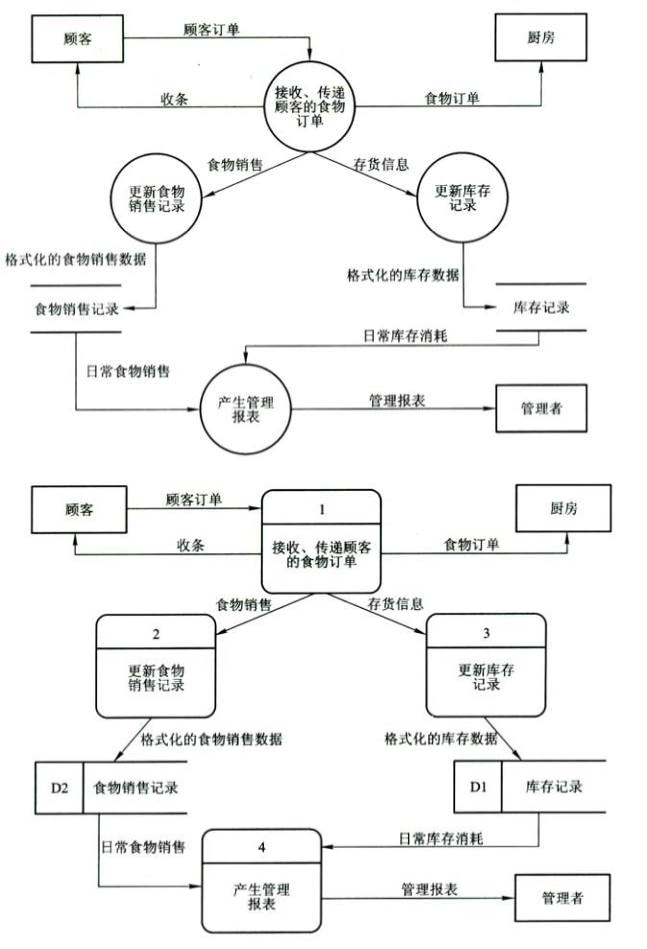

選擇題

1. 以下那一條不是軟件可靠性的基本准則（D）

    A 對象狀態和生命周期都應該是完備的、閉合的

    B 不可避免的或無法預測的故障需進行容錯

    C 故障應在第一時間檢測和感知

    D 資源不一定要合理和均衡地使用

2. 軟件生產中產生需求問題的最大原因在於對應用軟件的（C）理解不透測

    A 複雜性   B 目的性  C 模擬性   D 正確性

3. (A)是結構化分析方法的核心技術，它表明系統的輸入、處理、存儲和輸出，以及他們如何一起協調工作。
    
    A 數據流圖DFD
    
    B 實躰聯系圖ERD
    
    C 狀態轉換圖
    
    D上下文圖

4. 項目的前景和範圍文檔、軟件需求文檔都被視爲屬於（D），重點都是用戶的現實世界

    A 開發文檔

    B 需求文檔

    C 過程文檔

    D 用戶文檔

5. 現實世界中的（B）構成了問題解決的基本範圍，稱為該問題的問題閾。

   A 屬性和狀態

   B 實體和狀態

   C 實躰和操作

   D 狀態和操作

填空題

1. 需求分析不是一蹴而就，而是貫穿整個開發周期

2. 頭腦風暴是一種特殊的群體面談方式，它的目的不是發現需求，而是發明需求，或者説發現潛在需求,它鼓勵參與者在無約束的環境下進行某些問題的自由思考和自由討論，以產生新的想法。

3. 設計約束或實現約束描述在設計或實現應用系統時應遵守的限制條件。在需求分析階段提出這類需求，并不是取代設計（或實現）過程，只是説明用戶或環境强加給項目的限制條件。常見的約束有：精度，工具和語言約束；設計約束；應該使用的標準；應該使用的硬件平臺。

4. 產品特性可以稱為質量屬性，在众多质量属性中，对于开发人员来说重要的属性有可维护性、可移植性、可重用性、可测试性

5. 需求验证应该从一致性、现实性、完整性、有效性几个方面进行验证。

問答題

1. 需求分析工作包括哪些？
  需求分析过程中，包括的工作比较多， 主要是通过与客户进行直接交流和自己学习来进行获知。其主要包括：角色分析、业务流程分析、核心功能分析、关键需求点分析、用例分析、数据流图分析、核心功能点的时序分析、需求文档编写、调研记录和需求变更记录等。

2.  软件需求的分类。
    软件需求包括三个不同的层次：业务需求、用户需求和功能需求（也包括非功能需求）。

    业务需求（business requirement）反映了组织机构或客户对系统、产品高层次的目标要求，它们在项目视图与范围文档中予以说明。

    用户需求(user requirement) 文档描述了用户使用产品必须要完成的任务，这在使用实例（use case）文档或方案脚本说明中予以说明。

    功能需求(functional requirement)定义了开发人员必须实现的软件功能，使得用户能完成他们的任务，从而满足了业务需求。
    在软件需求规格说明书（SRS）中说明的功能需求充分描述了软件系统所应具有的外部行为。软件需求规格说明在开发、测试、质量保证、项目管理以及相关项目功能中都起了重要的作用。对一个大型系统来说，软件功能需求也许只是系统需求的一个子集，因为另外一些可能属于子系统（或软件部件）。

    作为功能需求的补充，软件需求规格说明还应包括非功能需求，它描述了系统展现给用户的行为和执行的操作等。它包括产品必须遵从的标准、规范和合约；外部界面的具体细节；性能要求；设计或实现的约束条件及质量属性。所谓约束是指对开发人员在软件产品设计和构造上的限制。质量属性是通过多种角度对产品的特点进行描述，从而反映产品功能。

3. 软件需求分析阶段每一个迭代周期的有哪些步骤？每一步主要做些什么？
    （1）需求捕获：根据了解的业务流程得到流程草图，将相关业务名词整理成类图或对象图，将要实现的功能整理成需求列表。
    （2）需求整理：对整个系统绘制用例图，并依次对这些用例进行用例描述、流程分析、角色分析等分析过程。
    （3）领域模型：是对用户业务领域中相关事务、相关关系、相互行为操作的描述
     (4)需求验证：首先，在需求分析阶段，需求验证工作表现为对需求理解是否正确的信息反馈。需求分析人员与客户再次坐在一起，一项一项描述我们对需求的整理和理解，客户则时不时地对一些问题进行纠正，或者更加深入地加以描述。我们则认真地记录，回来整理，并等待下一次的验证。在需求分析后期，我们还可以制作一些简单的原型，更加形象地描述我们对需求的理解，会使我们与客户的沟通更加顺畅。

4. 需求分析阶段完成后我们需要完成那些文档？
   数据要求说明书
   初步用户手册
   开发实验计划
   需求说明书

5. 请按下列描述，画出食物订货系统的过程模型图（DFD）。
    食物订货系统主要和3种外部的实体：顾客、管理者和厨房存在交互行为。首先，食物订货系统需要接收顾客的食物订单，并在接收后向顾客呈送一个收条，然后将订单转交系统内部的功能处理。其次，食物订货系统要能够将已经接收的食物订单及时的转交给厨房，这样厨房才能够根据订货的情况进行生产。最后，食物订货系统要能够基于一段时间的事务积累，为管理者提供管理报表，反映组织的生产状况。
    食物订货系统的内部功能主要有4个。第一个功能是接收顾客的食物订单，向顾客呈送收条，并将订单及时转交厨房，同时启动对订单的后续处理（第二个功能和第三个功能）。第二个功能是处理顾客食物订单，根据订单生成并记录食物的销售事务。第三个功能也是处理顾客食物订单，但其目的是根据订单更新库存信息，以保证生成的原材料供应。第四个功能是根据一段时间内的食物销售情况和库存管理情况，生成管理报表，向管理者反映组织的生产状况。
    在食物订货系统中，食物销售记录和库存记录是为了完成系统的功能（产生管理报表），组织希望储存的数据。

    